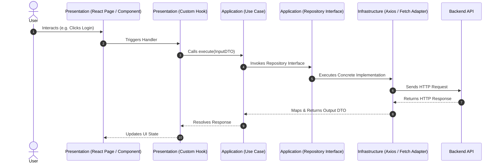
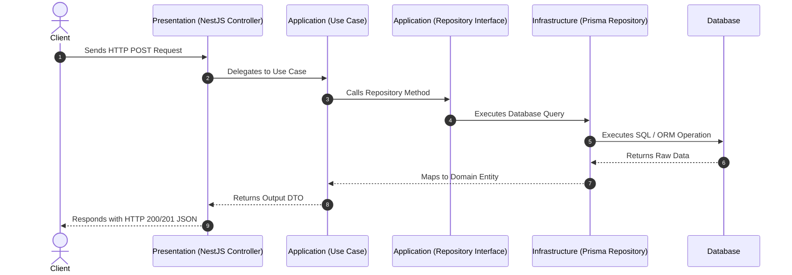

# AURA Framework

Production-Ready Fullstack Enterprise Architecture Framework based on Clean Architecture, Domain-Driven Design (DDD), Repository Pattern, and Modular Monolith principles.

AURA Framework decouples core business logic from UI frameworks, backend engines, ORMs, and third-party libraries, ensuring that application domain rules remain independent of external infrastructure choices.

---

## Principles

- **Framework Agnostic**: Core business domain logic has zero dependencies on UI libraries or backend frameworks.
- **Business First**: Code is organized around business domain capabilities rather than technical framework boundaries.
- **Dependency Rule**: Code dependencies point strictly inward toward the pure Domain layer.
- **Feature Isolation**: Each feature operates as an independent module with explicit barrel exports.
- **Modular by Default**: Designed as a Modular Monolith, ready to be extracted into Microservices when scaling demands.
- **Testability**: Use Cases and Domain Entities can be unit tested in isolation without mocking databases or HTTP servers.
- **Scalable**: Supports multi-team development with clear architectural boundaries.
- **Maintainable**: Single responsibility per class and strict architectural conventions.

---

## Features

### Frontend
- **React + Vite** as default presentation target
- **Next.js Ready**: Migrate to SSR/SSG without modifying application or domain layers
- **React Native Ready**: Share domain entities, contracts, and use cases directly with mobile targets

### Backend
- **NestJS** application module structure
- **Framework & ORM Agnostic**: Infrastructure supports Prisma, TypeORM, or custom DB drivers
- **Modular Monolith**: Clean module isolation ready for microservices extraction

### Core Architecture
- Pure Domain-Driven Design (DDD)
- Explicit Dependency Inversion & Repository Pattern
- Shared Pure Domain Package (`@aura/shared-domain`)
- Automated CLI Domain Generator (`npm run aura:create-domain`)

---

## Visual Request Flow & Dependency Rules

### Frontend Request Execution Flow



### Backend Request Execution Flow



---

## Quick Start: CLI Domain Generator

Scaffold a complete, 4-layered Clean Architecture domain feature across Frontend and Backend in a single command:

```bash
npm run aura:create-domain <domain-name>
```

### Example

```bash
npm run aura:create-domain order
```

**Generates:**
```text
apps/frontend/src/domains/order/
├── domain/ (entities, value-objects, services)
├── application/ (use-cases, dto, presenters)
├── infrastructure/ (api, repositories, cache)
├── presentation/ (components, hooks, pages)
└── index.ts

apps/backend/src/domains/order/
├── domain/, application/, infrastructure/, presentation/
├── order.module.ts
└── index.ts
```

---

## Why Clean Architecture?

| Architecture Pattern | Business Logic Isolation | Framework Independence | Scalability for Large Teams |
| :--- | :--- | :--- | :--- |
| **Traditional MVC** | Low (Coupled to Controllers & DB) | Low (Tightly bound to framework) | Low (Lead to God Controllers) |
| **Layered (3-Tier)** | Medium (Business depends on DB) | Medium | Medium |
| **Feature Folders Only** | Low (No layer enforcement) | Low | Medium |
| **AURA Clean Architecture** | **High (100% Isolated Domain)** | **High (Framework Agnostic)** | **High (Enforced Boundaries)** |

### Architecture Decisions
- **Why not MVC?** MVC couples business rules to controllers and ORM models, leading to fat controllers that are difficult to unit test and maintain.
- **Why not Layered Architecture?** Traditional 3-tier architecture places the Database at the bottom, forcing the business layer to depend directly on database schemas.
- **Why Clean Architecture + DDD?** Clean Architecture inverts the database dependency, ensuring business logic depends only on abstractions (`IRepository`), making databases and delivery mechanisms interchangeable.

---

## Repository Structure & Documentation

```text
aura-framework/
│
├── apps/
│   ├── frontend/             # Single-Page App or SSR Presentation Targets
│   └── backend/              # Modular Monolith / Microservices Backend
│
├── packages/
│   ├── shared-domain/        # Pure Core Domain Abstractions & Contracts (Entity, ValueObject, IRepository)
│   ├── shared-types/         # Global Type Definitions & Contracts
│   ├── shared-ui/            # Cross-Platform Design System Components
│   ├── shared-utils/         # Common Helper Functions & Utilities
│   └── eslint-config/        # Monorepo Code Quality & Lint Rules
│
├── docs/                     # Architecture Documentation
│   ├── project-structure.md  # 5-Minute Monorepo & Layer Responsibility Guide
│   ├── conventions.md        # Naming & Coding Conventions
│   ├── adr.md                # Architecture Decision Records
│   └── roadmap.md            # Release & Feature Evolution Roadmap
│
├── scripts/                  # Automation Scripts (create-domain.js)
└── package.json
```

---

## Documentation Links

- [Project Structure & Layer Guide](docs/project-structure.md)
- [Coding Conventions](docs/conventions.md)
- [Architecture Decision Records (ADR)](docs/adr.md)
- [Framework Roadmap](docs/roadmap.md)
- [Contribution Guidelines](CONTRIBUTING.md)
- [Security Policy](SECURITY.md)

---

## Sample Domains Guide

Starter features use standard domain names as boilerplate references:

```text
domains/
├── auth/                   # Authentication & Token Management
├── user/                   # User Management Sample Domain
└── product/                # Product Catalog Sample Domain
```

> **Note:** These are sample domains. Replace them with your own business domains (e.g., HR, CRM, ERP, E-Commerce, POS, Hospital, School).

---

## Philosophy

Frameworks are temporary. Business is permanent.

Frameworks, libraries, and databases inevitably change over time, but business rules remain constant. AURA Framework ensures that business logic stays decoupled from delivery mechanisms and persistent storage.

---

## License

MIT © AURA Framework
